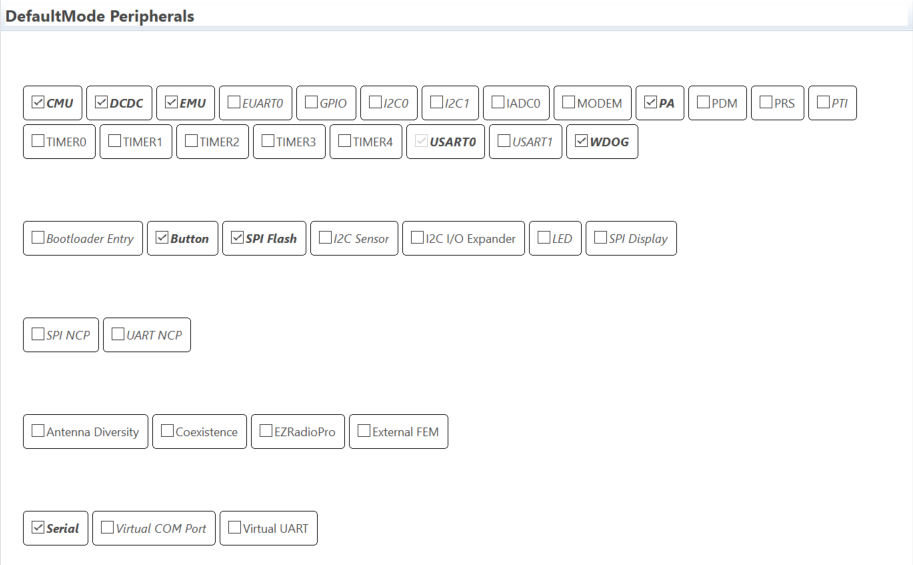
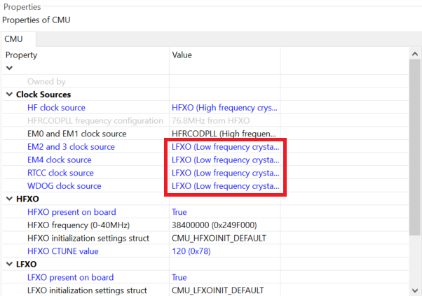
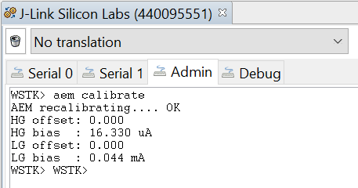

# Optimization on EM2 Current Consumption of the Sleepy Z3Swtich Example Project
## Introduction
In this article, we implement a sleepy switch based on the Z3Switch template in Simplicity Studio. The switch should be able to join a network and bind to a light inside without interference from console. As a sleepy end device, we also require a low power consumption during the sleep period. A concrete guide to achieve a working light - switch combination and lower the EM2 current of the switch down to about 1.5 uA is provided. Comparison among the impact of different configurations is included. Troubleshooting approaches also present in this article.
## Prerequisites
* 2 WSTK Main Development Board  
* 1 EFR32xG22 2.4GHz 6 dBm Radio Board (BRD4182A Rev B03)  
* 1 EFR32MG12 2.4GHz 10 dBm Radio Board (BRD4162A Rev A01)  
* Simplicity Studio SV5.0.0.0  
* EmberZNet 6.8.0.1  
## Steps  
### Build a Z3Light Project  
1. Create a "Z3Light" template for EFR32MG12 (BRD4162A Rev 01).  
  
2. Change "ZigBee Device Type" to "Coordinator or Router".  
  
3. Generate and build the project.  
4. Before we flash the compiled firmware to the board, make sure that there is already a correct bootloader on the board. Please refer to https://github.com/SiliconLabs/IoT-Developer-Boot-Camp/wiki/Zigbee-Preparatory-Course#32-using-gecko-bootloader.  
5. Flash the compiled firmware to EFR32MG12.  
### Build a Z3Switch Project  
1. Create a "Z3Switch" template for EFR32xG22 (BRD4182A Rev 03).  
  
2. Change "ZigBee Device Type" to "Sleepy End Device".  
  
3. Disable serial communication (optional):  
    1. Select "ZCL Framework Core, provides API: command-interpreter2" plugin, un-check the "Enable Command Line for Legacy CLI" option on the right.  
      
    2. Select "Serial, provides API: serial" plugin, under "Hardware Configurator Dependent Module Options" on the right, select "SERIAL", change its "Port for application serial communication" property to "None"; select "USART1", un-check the "Enabled" checkbox.  
      
    3. Un-check "Enable debug printing" checkbox and change "Use Command Set" option to "None".  
      
    *Disabling serial communication lowers the EM2 current by about 0.05 uA.*  
4. Enable "Main Init" callback under "Non-cluster related".  
  
5. Configure & initialize peripherals.  
Modifications on hardware configuration reflects in "hal-config.h" file located under "hal-config/" directory. In order to lower the power consumption, it's highly recommended to disable unnecessary peripherals. For peripherals that cannot be disabled by hardware configurator, or some of the necessary ones, initialize them manually in main initial callback function. Please note that "EMU" and "SPI Flash" should be added, for the former one enables support for energy management functions, the latter one adds definition source code of the flash on the radio board, making it possible to shut it down to lower power consumption.  
    1. Under the switch project folder, find and open the .hwconf file. Make sure only the following peripherals are checked:  
      
    2. Change the last four "Clock Sources" properties of "CMU" to "LFXO", as in the screenshot shown below.  
      
    3. Save and generate the project.  
    4. Open "*YourProjectName*_callbacks.c" file located directly under the root of the switch project folder. Create the following function at the end of this file.  
    ```
    void emberAfMainInitCallback (void)
    {
    }
    ```
    5. Initialize DCDC. Because "_EMU_DCDCCTRL_MASK" is not defined for BRD4182A, code initializing DCDC is excluded from "hal-library/EFR32/hal-config.c" while compiling. We may add the following code manually to initialize it. For further details, refer to UID 475287.  
    ```
    #include "em_emu.h"
    ```
    ```
      EMU_DCDCInit_TypeDef dcdcInit = EMU_DCDCINIT_DEFAULT;
    // Enable DC-DC converter
      EMU_DCDCInit (&dcdcInit);
    ```
    6. Power down SPI flash. Find and copy the files "mx25flash_spi.h" and "mx25flash_spi.c" from "${StudioSdkPath}\hardware\kit\common\drivers", to the root of the switch project folder. For example, it may be located at "C:\SiliconLabs\SimplicityStudio\v5\developer\sdks\gecko_sdk_suite\v3.0\hardware\kit\common\drivers". We may add the following code to power down the flash manually. Please note that plugin EEPROM POWERDOWN cannot be used on firmware built for BRD4182A to power down the flash. For further details, refer to UID 474616.  
    ```
    #include "mx25flash_spi.h"
    ```
    ```
    // Power-down the radio board SPI flash
      FlashStatus status;
      MX25_init ();
      MX25_RSTEN ();
      MX25_RST (&status);
      MX25_DP ();
      MX25_deinit ();
    ```
    7. Disable watch dog.  
    ```
    halInternalDisableWatchDog (MICRO_DISABLE_WATCH_DOG_KEY);
    ```
    8. The following function, which can be appended to the end of this file, provides a summary of the last three steps.  
    ```
    void emberAfMainInitCallback (void)
    {
      EMU_DCDCInit_TypeDef dcdcInit = EMU_DCDCINIT_DEFAULT;
    // Enable DC-DC converter
      EMU_DCDCInit (&dcdcInit);
    // Power-down the radio board SPI flash
      FlashStatus status;
      MX25_init ();
      MX25_RSTEN ();
      MX25_RST (&status);
      MX25_DP ();
      MX25_deinit ();
      halInternalDisableWatchDog (MICRO_DISABLE_WATCH_DOG_KEY);
    }
    ```
    *Please note that setting EMU voltage scaling to low power mode also helps a lot, since such code already presents in the stack, there is no need to implement it again.*  
6. Save and build the project.  
7. Before we flash the compiled firmware to the board, make sure that there is already a correct bootloader on the board.  
8. Flash the compiled firmware to EFR32xG22.  
## Test the Function of the Light - Switch Combination  
There is a description of how the light - switch combination works under the .isc file tab → General tab → Information Configuration. Please follow the description to form & join network and pair the light and switch. After pairing, we can use PB0 on the switch to control LED0 on the light.  
### *Troubleshoot During Joining & Pairing*  
*Sometimes the test environment is noisy, causing the light and switch not work as intended. A handy troubleshoot guide is provided below.  
In case that a timeout has occurred on the light side and the light no longer accepts new device to join its network, type the command below in a console connected to the light followed by an Enter.*  
```
plugin network-creator-security open-network  
```
*Please note that the switch may behave differently on a distributed network than on a centralized network. Type "info" in a console connected to the light and check whether the nodeID is 0x0000. If not, instruct the light to form a centralized network, enter the commands below sequentially, press Enter after each command.*  
```
network leave  
plugin network-creator start 1  
plugin network-creator-security open-network  
```
*Now in case the switch has already joined another network, erase the switch, flash a correct bootloader and re-flash the newly compiled .s37 firmware for the switch.*  
## Test the EM2 Current Consumption of the Switch  
Before current measurement, use command "aem calibrate" to run AEM calibration first.  
  
Click the Open Perspective icon on the top right corner of Simplicity Studio, select Energy Profiler, click Open. Click Quick Access on the top left corner and select Start Energy Capture. Select EFR32xG22 board and click OK. Press RESET button on the main board. The screenshot below contains an event that an ON command was sent to the light. Currently the EM2 current of the switch is about 2.2 uA.  
  
In accordance with "AEM Accuracy and Performance" section from [UG172](https://www.silabs.com/documents/public/user-guides/ug172-brd4320a-user-guide.pdf), when measuring currents below 250 uA, the accuracy is 1 uA. Thus, currently it is necessary to measure the current using a high-accuracy DC analyzer. According to the test result shown below, the actual EM2 current is about 1.523 uA. Please note that the result includes a typically 0.2 uA deep power-down current from the external SPI flash in low power mode. In accordance with section 4.6.1 from the datasheet of BRD4182A, which is the target board for switch in this article, the MCU current consumption using DC-DC at 3.0 V input in EM2 mode, VSCALE0, with full RAM retention and RTC running from LFXO, at 25 degrees Celsius, is 1.40 uA.  
  
A table showing the effect of code segments which initializes DCDC, powers down SPI flash and disables watch dog is provided below for reference.  
present code segment(s) | EM2 current (uA)
-|-|
none | 9.90
initializing DCDC | 8.85
initializing DCDC & powering down SPI flash | 2.56
initializing DCDC & powering down SPI flash & disabling watch dog | 2.19
## Notes & Known Issues  
1. Make sure the light is open to pairing requests while the switch is joining its network. The switch only tries to pair with a light right after a successful joining to network. If it fails to pair after joining, the only recovery approach we have found so far is erasing and re-flashing the switch.  
2. Temperature inflects a lot on the current consumption. A long-time-running board may consume about 0.2 uA more than a just-turned-on board.  
3. The real time live result is measured regardless of the base current of the board, causing the current in the saved result higher than the real time live result in Energy Profiler. For more details, please refer to UID 618380.  
  
4. Thanks to a technical bug of the current version of Simplicity Studio, the current measured may stay at about 80 uA. In such situation, a re-flash of the .s37 firmware before a reset is needed to recover. For more details, please refer to UID 519744.  
5. When the switch loses contact with the light (e.g. the light powers down) after a successful pairing, the switch will keep itself awake at about 2 mA current consumption until it successfully recovers the connection after PB1 on it is pressed. For more details, please refer to UID 621461.  
## Further Optimization  
Since the switch has no task other than sending on/off commands, we can reduce the poll times while awake by setting wake timeout period to 1. To change wake timeout period: find and click on the "End Device Support" plugin, under "Options" on the right, change "Wake Timeout (seconds)" field to 1.  
  
